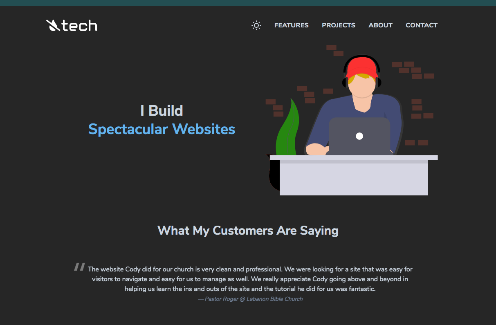

# No Sweat Tech

Built with [Gridsome](https://gridsome.org) and [Tailwind](https://tailwindcss.com).

## Features

- Based on Andre Madarang's starter here: https://github.com/drehimself/gridsome-portfolio-starter
- Clean and minimal design
- [Tailwind](https://tailwindcss.com) (with PurgeCSS)
- Scroll to sections using [vue-scrollto](https://github.com/rigor789/vue-scrollto)
- Theme Switcher with Dark Mode
- 404 Page
- Sitemap in XML

## Installation

1. Install Gridsome CLI tool if you don't have it: `yarn global add @gridsome/cli`
1. Clone the repo: `git clone https://github.com/codybarr/nosweat.tech`
1. `cd nosweat.tech`
1. `yarn`
1. `gridsome serve` to start a local dev server at `http://localhost:8080`

## Notes

- Illustrations from [unDraw](https://undraw.co)
